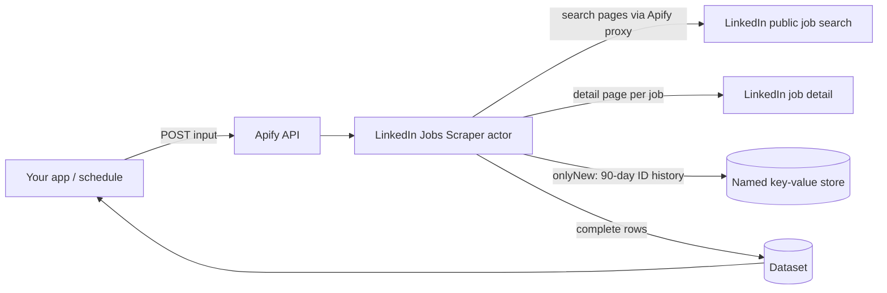

# LinkedIn Jobs Scraper Docs

[](https://apify.com/agnes.developer.queen/linkedin-jobs-scraper)
[](LICENSE)

Consumer documentation and integration examples for the LinkedIn Jobs Scraper actor on Apify. Public LinkedIn job postings with the full job description, no login, $2 per 1,000 jobs, and a built-in new-jobs monitor for scheduled runs.

The actor lives on Apify Store: https://apify.com/agnes.developer.queen/linkedin-jobs-scraper

This repo contains documentation, the input and output shape, and integration examples in curl, Node and Python. The actor source itself is not in this repo. Use this README to wire the actor into your code.

## What it does

You send a keyword and location (or up to 20 LinkedIn `/jobs/search` URLs). The actor collects the matching public job postings, opens each detail page, and returns one row per job with the full description text, company, location, posted date and the other fields LinkedIn publishes. No login or cookies are needed.

Measured on the September 27, 2026 cloud benchmark: 20 searches across the US, UK, Canada, Germany and Australia delivered 500 jobs from 506 attempted detail pages (98.81%), and 50 independently re-checked job identities all matched. Those are results from that benchmark, not a promise of exhaustive LinkedIn coverage.

Three things set it apart:

- **Full descriptions only.** A row is delivered and charged only when it has a confirmed identity and a description of at least 100 characters. Incomplete pages, duplicates and title-filter rejects are skipped for free.
- **Title filters.** `titleIncludes` and `titleExcludes` cut noise before anything is charged.
- **New-jobs monitor.** Set `onlyNew: true` on a scheduled run and each run returns only job IDs not delivered by the same configuration in the previous 90 days.

## Architecture



## Request flow

```mermaid
sequenceDiagram
    participant App as Your App
    participant API as Apify API
    participant Actor as Jobs Scraper
    participant LI as LinkedIn (public)
    App->>API: POST /acts/agnes.developer.queen~linkedin-jobs-scraper/runs
    API->>Actor: Start run (charges apify-actor-start)
    Actor->>LI: Search pages, newest first
    LI-->>Actor: Job cards
    loop each candidate until maxJobs
        Actor->>Actor: Skip duplicates / seen IDs / title-filter rejects
        Actor->>LI: Fetch job detail page
        LI-->>Actor: Full description
        Actor->>API: Push row, charge one `job` event
    end
    Actor->>API: Write RUN_SUMMARY and DIAGNOSTICS to key-value store
    App->>API: GET dataset items
    API-->>App: JSON / CSV / Excel rows
```

## Input

From the actor's input schema. All fields are optional; with no input the actor runs the prefilled `software engineer` / `United States` search.

| Field | Type | Default | Meaning |
| --- | --- | --- | --- |
| `searchUrls` | array of strings | none | Up to 20 HTTPS LinkedIn `/jobs/search` URLs. Use these OR the keyword/location fields. Unsupported filters are rejected. Results are sorted newest first. |
| `keywords` | string | prefill `software engineer` | Search phrase. Use with `location`, without search URLs. |
| `location` | string | prefill `United States` | Location sent to LinkedIn. LinkedIn controls geographic matching; this is not a verified geographic boundary. |
| `companyIds` | array of strings | none | Optional numeric LinkedIn company IDs sent as the source's company filter. Use with keywords/location. |
| `postedWithinDays` | integer (1 to 30) | any age | Source posting-age filter. Runtime accepts 1, 7 or 30. Use with keywords/location. |
| `titleIncludes` | array of strings | none | Case-insensitive literal phrases. A delivered title must contain at least one, if supplied. |
| `titleExcludes` | array of strings | none | Reject titles containing any of these case-insensitive literal phrases. |
| `maxJobs` | integer (1 to 10000) | `100` | Global delivery cap across all searches; incomplete and duplicate jobs do not count. |
| `onlyNew` | boolean | `false` | Suppress IDs delivered by this same search/filter configuration in the previous 90 days. Requires access to named storage. Use one non-overlapping schedule per configuration. |
| `proxyConfiguration` | object | `{ "useApifyProxy": true }` (datacenter) | Direct requests and residential proxy are optional; direct requests can be rate-limited. Proxy costs are included in event pricing. |

Minimal input:

```json
{
  "keywords": "software engineer",
  "location": "United States"
}
```

Each search scans at most 1,000 source candidates or 100 pages. Split broad searches into several narrower ones or several `searchUrls` for more volume.

### Monitor mode (new jobs only)

Set `onlyNew` to `true`, save the input as a task and schedule it. The first run delivers matching jobs up to `maxJobs`. Later runs skip job IDs already delivered under the same search and title filters within the previous 90 days. Capped or failed jobs are not marked as seen, so they arrive on the next run. History lives in the named key-value store `linkedin-jobs-monitor-v1` in your account; deleting it resets the baseline.

Rules: one schedule per configuration, and do not let runs of the same configuration overlap. Different searches keep separate histories and can run in parallel. Adding `postedWithinDays: 1` keeps a daily run focused on fresh postings. See [examples/monitor.json](examples/monitor.json).

## Output shape

One dataset row per delivered job. This is a real record from the September 27, 2026 benchmark, as published in the actor's Store README; `descriptionText` is shortened there and here, the delivered row holds the full text.

```json
{
  "jobId": "4419969671",
  "url": "https://www.linkedin.com/jobs/view/4419969671/",
  "title": "Senior Software Engineer – Go (Golang)",
  "companyName": "General Motors",
  "companyUrl": "https://www.linkedin.com/company/general-motors/",
  "location": "Warren, MI",
  "descriptionText": "(full job description text)",
  "postedAtRaw": "2 weeks ago",
  "postedAt": "2026-09-12",
  "postedAtPrecision": "day",
  "postedAtEstimated": false,
  "salaryText": null,
  "employmentType": "Full-time",
  "seniorityLevel": "Not Applicable",
  "jobFunction": null,
  "industries": null,
  "jobPosterName": null,
  "jobPosterUrl": null,
  "scrapedAt": "2026-09-27T15:31:19.157Z"
}
```

| Field | What it holds |
| --- | --- |
| `jobId` | LinkedIn job ID |
| `url` | Canonical job URL |
| `title` | Job title from the detail page |
| `companyName` | Hiring company |
| `companyUrl` | Company LinkedIn page |
| `location` | Location as shown on the posting |
| `descriptionText` | Full job description text (at least 100 characters, or the job is not delivered) |
| `postedAtRaw` | Date text as displayed, for example "2 weeks ago" |
| `postedAt` | Source date `YYYY-MM-DD`, or an approximate timestamp from relative text |
| `postedAtPrecision` | `day`, `approximate` or null |
| `postedAtEstimated` | `true` when the date is an estimate |
| `salaryText` | Salary text when the posting publishes it |
| `employmentType` | Full-time, part-time, contract and so on |
| `seniorityLevel` | Seniority level as published |
| `jobFunction` | Job function as published |
| `industries` | Industries as published |
| `jobPosterName` | Name of the job poster when shown |
| `jobPosterUrl` | Job poster profile URL when shown |
| `scrapedAt` | Collection timestamp |

Missing optional values are `null`. The actor does not guess emails, hiring managers, salaries or applicant counts. Each run also writes `RUN_SUMMARY` (per-search counts and stop reasons) and `DIAGNOSTICS` (errors) to the run's key-value store, outside the job dataset.

## Pricing

Pay per event on Apify, the same on every plan tier:

| Event | Price |
| --- | --- |
| `job` (one complete job delivered to the dataset) | $0.002 |
| `apify-actor-start` (per run, one per GB of memory, minimum one) | $0.00005 |

1,000 jobs cost 1,000 x $0.002 = $2.00, plus $0.00005 for the run start at the default 256 MB memory. Proxy costs are included. There is no subscription, no minimum, and no extra platform-usage charge.

A `job` event fires only for a unique matching job with confirmed identity and a full description. Incomplete detail pages, duplicates, jobs already seen by the monitor, and titles rejected by your filters are not charged.

Apify's free plan includes $5 of monthly credit, which covers about 2,500 jobs a month before you pay anything.

## Use cases

1. Recruiting pipelines that pull full job descriptions for a title and region into an ATS or spreadsheet.
2. Daily new-jobs alerts for a saved search, using `onlyNew` on a schedule so you only process postings you have not seen.
3. Job boards and aggregators that need a clean, deduplicated feed with posted dates.
4. Labour-market research: hiring volume, seniority and employment-type mix per company, title or location.
5. Sales intelligence that flags companies hiring for roles your product serves, via `companyIds` or title filters.
6. Training and evaluation datasets of real job descriptions for classifiers and LLM pipelines.

## Examples

See [examples/curl.sh](examples/curl.sh), [examples/node.js](examples/node.js) and [examples/python.py](examples/python.py) for working consumer-side snippets that call the public Apify API, and [examples/monitor.json](examples/monitor.json) for a scheduled new-jobs monitor input.

The examples use `run-sync-get-dataset-items`, which waits for the run (up to 300 seconds) and returns the dataset in one call. For large `maxJobs` values start the run with `POST /v2/acts/agnes.developer.queen~linkedin-jobs-scraper/runs` and fetch `GET /v2/datasets/{defaultDatasetId}/items` when it finishes.

```bash
curl -X POST "https://api.apify.com/v2/acts/agnes.developer.queen~linkedin-jobs-scraper/run-sync-get-dataset-items?token=$APIFY_TOKEN" \
  -H "Content-Type: application/json" \
  -d '{"keywords": "software engineer", "location": "United States", "maxJobs": 25}'
```

## Authentication

You need an Apify API token. Get one at https://console.apify.com/account/integrations.

Set it as an environment variable:

```
APIFY_TOKEN=apify_api_xxxxxxxxxxxxxxxxxxxxx
```

The examples in this repo read from `APIFY_TOKEN`. No LinkedIn login, cookies or session are needed; the actor only reads postings LinkedIn shows publicly.

## Related actors

Pay-per-result scrapers from the same account, no login required:

- [LinkedIn People Search Scraper](https://github.com/agnesthedeveloper/linkedin-people-search-scraper)
- [Google Ads Transparency Scraper](https://github.com/agnesthedeveloper/google-ads-transparency-scraper)
- [LinkedIn Ad Library Scraper](https://github.com/agnesthedeveloper/linkedin-ad-library-scraper)
- [LinkedIn Company Scraper](https://github.com/agnesthedeveloper/linkedin-company-scraper)
- Hub: [agnes-apify-actors](https://github.com/agnesthedeveloper/agnes-apify-actors)

## Support

Open an issue on the actor's Issues tab on Apify Store. Include the run ID, your input and what you expected to see.

## License

MIT, see [LICENSE](LICENSE).

The actor source is hosted on Apify and is not included in this repo. This repo is for consumer documentation and examples only.
